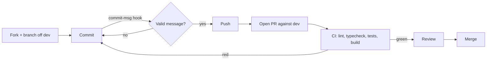

# Contributing to Quested

Hey! Thanks for even considering this. Quested is a one-person side project I build on evenings and weekends, so any help (code, ideas, bug reports) genuinely makes a difference.

## Before you start

Got an idea for a feature, or want to tackle something bigger than a one-line fix? [Open an issue](https://github.com/itsarnaud/quested/issues/new/choose) first and let's talk about it. Not because you need permission, but because I might already be halfway through it, or have a slightly different idea of where it should go. Better to figure that out before you spend your evening on a PR.

If it's small and obvious (a typo, a broken link, a clear bug with a clear fix), just go straight to a PR. No need to ask.

## Found a bug? Have an idea?

Open a [GitHub issue](https://github.com/itsarnaud/quested/issues/new/choose) using the bug report or feature request form. They ask for the things I'd ask you for anyway (repro steps, expected vs. actual behavior, the problem a feature would solve), so filling them in properly usually gets a faster reply.

## Getting set up

The [README](README.md#running-locally) walks through getting a local instance running: database, env vars, migrations, all of it. `npm run test` needs that same local database running, since some of the tests hit it directly.

## How a contribution flows



- Fork it, branch off `dev`. That's where the day-to-day work happens. `main` only ever moves when I cut a release.
- Name your branch `feat/short-description` or `fix/short-description`. Doesn't need to be clever, just enough for me to tell at a glance what it's about.
- Open your PR against `dev`.
- Try to keep each PR about one thing. Easier to review, easier to merge.

## Automated checks

A few things run automatically so neither of us has to remember to do them by hand:

- **On commit** (a git hook, runs on your machine): ESLint on the files you staged, then a full-project type check. A commit is blocked until both pass.
- **On the commit message** (also a local hook): [commitlint](https://commitlint.js.org) checks it matches the convention below. `git commit` will refuse a message that doesn't.
- **On push / on the PR** (GitHub Actions, see `.github/workflows/ci.yml`): the same lint and type check, plus the full test suite against a fresh database, plus a production build. This is the one that has to be green before a merge.

None of this should surprise you if the sections below are followed, it's just there so a slip doesn't reach `dev` by accident.

## Before you open a PR

- `npx tsc --noEmit`, `npm run lint`, and `npm run test` should all come back clean (the hooks above check the first two automatically; run the tests yourself since they need a live database).
- For anything UI-related, also click around in the browser (`npm run dev`), including at a narrow/mobile width.
- If you seeded any test data locally to check your change, clean it up before you're done.

## Commit messages

Take a look at `git log` for the vibe, but roughly: English, one line, describes the thing from a user's point of view rather than how you built it. It has to start with one of these types (enforced by commitlint, see `commitlint.config.js`):

- `feat` : a new feature or user-facing change
- `fix` : a bug fix
- `docs` : documentation only
- `refactor` : restructuring code with no behavior change
- `test` : adding or fixing tests
- `chore` : everything else (deps, tooling, config)
- `ci` : CI/CD workflow changes

```
feat: add rating distribution and stats to the profile page
fix: prevent horizontal scroll from long game titles in the activity feed
```

## Code style

- Skip comments unless something is genuinely non-obvious (a weird constraint, a workaround, something that'd make someone go "wait, why?"). If the code already reads clearly, a comment is just noise.
- Don't build an abstraction for one caller. Three similar lines beat a "clever" helper nobody else uses.
- Try to match what's already there: how components are structured, how Tailwind is used, how tRPC procedures are written. Rather than introducing a new way of doing something the codebase already does somewhere else.

## On response times

I'm not going to pretend this is my job. It's evenings and weekends, so reviews might take a few days. If it's quiet for a bit, it's not that I don't care, I promise.
